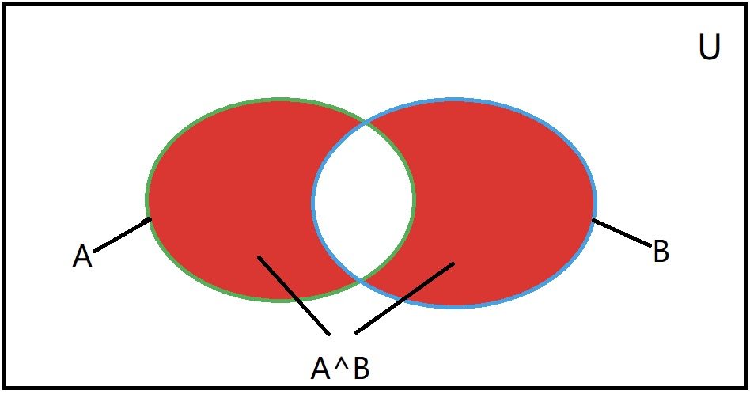

# Datalab实验报告

## 1. bitXor 
- x^y using only ~ and & <br>
- Example: bitXor(4, 5) = 1 <br>
- Legal ops: ~ & <br>
- Max ops: 14 <br>
- Rating: 1 <br>

思路：
<div align = center>
  
</div>
利用集合的思路，异或是求两个集合A、B不相交的部分。可以先求相交部分的补集($\neg$(A$\land$B))，然后再和A、B的并集(A$\vee$B)相交。对应到位运算为~(x&y)&(x|y)。**然而，我们不能用或运算(|)，只能用取反(~)和与运算(&)。因此我们利用双重否定和德摩根律来表达或运算**

<p>
    <center>
        x|y = (~~x)|(~~y) = ~(~x&~y)
    </center>
</p>

因此最终的结果为
```
int bitXor(int x, int y) {
  return ~(x&y)&(~(~x&~y));
}
```

## 2.thirdBits 
- return word with every third bit (starting from the LSB) set to 1
- Legal ops: ! ~ & ^ | + << >>
- Max ops: 8
- Rating: 1

思路：厘清题目含义是本题的关键，本题要求返回从最低位开始100100的数，即(...01001001)。我们能用的常数范围在0xFF内，故可用01001001(73)作为我们的初始值。
<br><br>
代码实现:
```c
int thirdBits(void) {
    int ans = 73;
    ans = (ans << 9) + ans;
    ans = (ans << 18) + ans;
    return ans;
}
```

## 3. fitsShort
- return 1 if x can be represented as a 16-bit, two's complement integer.
- Examples: fitsShort(33000) = 0, fitsShort(-32768) = 1
- Legal ops: ! ~ & ^ | + << >>
- Max ops: 8
- Rating: 1

思路：对于正数，能用short型表示的充要条件是前16位包括第15位均为0（也即前17位均为0）；对于负数，能用short型表示的充要条件为前17为均为1（这样才能保证按位取反再加一后的值不会超过16位）。综上，fitsShort的充要条件为前17位均为0或均为1。<br><br>
代码实现:
```c
int fitsShort(int x) {
  int y = x >> 15;  // 取前17位
  return !((y >> 1) ^ y);  //判断是否全是0或全是1
}
```

## 4. isTmax
- returns 1 if x is the maximum, two's complement number, and 0 otherwise 
- Legal ops: ! ~ & ^ | +
- Max ops: 10
- Rating: 1

思路：Tmax+1 = Tmin，2*Tmin = 0（且只有Tmin和0会乘2后得0）故先即y=x+1，然后再检验y+y是否为0。**但需要注意的是如果x一开始就是-1，那么y=0，y+y=0。这时我们利用!y除去y=0的特殊情况。**
<br><br>
代码实现:
```c
int isTmax(int x) {
  int y = x+1;
  return !((y+y)+(!y));
}
```

## 5. fitsBits
- return 1 if x can be represented as an n-bit, two's complement integer.
- 1 <= n <= 32
- Examples: fitsBits(5,3) = 0, fitsBits(-4,3) = 1
- Legal ops: ! ~ & ^ | + << >>
- Max ops: 15
- Rating: 2

思路：本题与fitsShort有异曲同工之妙。short有16位fitsShort中我们先右移了15位，由此同理我们要将x右移n-1位（由于题目说明了n>=1故不用考虑n=0的情况）。n-1应该使用n+~0来表示，不过此处由于编译器和考试符号优化的缘故，可以写成n+31。
<br><br>
代码实现:
```c
int fitsBits(int x, int n) {
    int y = x >> n+31;
    // if in a project x >> (n+~0) would be better
    return !(y^(y>>1));
}
```

## 6. upperBits
- pads n upper bits with 1's
- You may assume 0 <= n <= 32
- Example: upperBits(4) = 0xF0000000
- Legal ops: ! ~ & ^ | + << >>
- Max ops: 10
- Rating: 1

思路：先用1<<31得到Tmin，然后再右移n-1位(此处依然可以用n+31减少一个符号)。**再考虑n=0和n=32的特殊情况，n=32由于编译器优化的缘故，在考试完成作业的角度可以不用考虑（若要考虑则使用先左移n-1再左移1的方式处理）；n=0的话可以让Tmin左移!n来置0从而解决**
<br><br>
代码实现:
```c
int upperBits(int n) {
  return (1 << 31 << !n) >> (n+31); 
}
```

## 7. anyOddBit
- return 1 if any odd-numbered bit in word set to 1
- Examples anyOddBit(0x5) = 0, anyOddBit(0x7) = 1
- Legal ops: ! ~ & ^ | + << >>
- Max ops: 12
- Rating: 2

思路：0x5 = 101,0x7 = 111;由anyOddBit(0x5) = 0, anyOddBit(0x7) = 1可知，题目中最低位是定义为0的，我们要判断一个数所有2的奇数次位是否有1。那么我们可以通过构造常数10101010...（或者01010101...，但后者经过测试需要多一个符号位）然后做与运算判断是否不为0来实现。
<br><br>
代码实现:
```c
int anyOddBit(int x) {
    int initMask = 0xaa;
    int halfMask = (initMask << 8) | initMask;
    int allMask = (halfMask << 16) | halfMask;
    return !!(allMask & x);
}
```

## 8. byteSwap
- swaps the nth byte and the mth byte
- Examples: <br>
  - byteSwap(0x12345678, 1, 3) = 0x56341278 
  - byteSwap(0xDEADBEEF, 0, 2) = 0xDEEFBEAD
- You may assume that 0 <= n <= 3, 0 <= m <= 3
- Legal ops: ! ~ & ^ | + << >>
- Max ops: 25
- Rating: 2

思路：利用两次异或恢复原状的性质(a^b^a = b)——假设要交换的两个部位分别为a和b，则先取c = a^b，然后再a^c = b，b^c = a达到交换btye的效果。
<br><br>
代码实现:
```c
int byteSwap(int x, int n, int m) {
  // byte = 8*bit
  int n_shift =  n << 3;
  int m_shift =  m << 3;
  // 将两个要交换byte异或并存储至xor变量中
  int xor = ( ( x >> m_shift ) ^ ( x >> n_shift) ) & 0xFF;
  // 要交换的byte为xor，不交换部分为0x00，这样x与右式异或后就得到了目标结果
  return x ^ ( ( xor << m_shift ) | ( xor  << n_shift ) );
}
```

## 9. absVal
- absolute value of x
- Example: absVal(-1) = 1.
- You may assume -TMax <= x <= TMax
- Legal ops: ! ~ & ^ | + << >>
- Max ops: 10
- Rating: 4
  
思路：对于取负号，补码的实现方式是按位取反再加一。但是这种方法不能在本题直接使用，因为我们要实现对正数和负数取绝对值，必然要使用一些x为正和x为负时值不同的变量，但取反这个操作是不能根据正负号来决定取或不取的。不过我们可以借鉴补码的这个思路，有个很巧妙的操作——先使x右移31，记为mask。当x非负时mask为0；当x为负数时mask为-1(0xFFFFFFFF)。**让一个数和-1异或等价于对这个数按位取反。** 于是我们有了下面这段代码实现。
```c
int absVal(int x) {
  int mask = x >> 31;
  return (x+mask)^mask; //x>=0: (x+0)^x=x; x<0: (x+(-1))^(-1)=~(x-1)=-x
}
```

## 10. divpwr2
- Compute x/(2^n), for 0 <= n <= 30
- Round toward zero
- Examples: divpwr2(15,1) = 7, divpwr2(-33,4) = -2
- Legal ops: ! ~ & ^ | + << >>
- Max ops: 15
- Rating: 2

思路：对于正数和负数，直接右移1位，得到的都是该数除2的下取整（即5>>2 = 2, -5>>2 = -3），然而本题要求是向0取整，故负数的情况需要向上取整（不能简单地认为是加1，因为可能出现整除的情况）。最直接的想法是设一个变量来判断一个数是否即是负数又不能被$2^n$整除，即最高位为1且最低的n位均为0。
```c
int divpwr2(int x, int n) {
    // 若x为负数，则low_n_one为低n位全为1
    int p = x >> 31;
    int low_n_one = (p << n) ^ p;
    // 若x低n位有1则不能被2的n次方整除，需要加1
    int addOne = !!(low_n_one & x);
    return (x >> n) + addOne;
}
```
这种方法从思维上最直接但是花费的运算符个数较多，经过优化后，可以这样写。
```c
int divpwr2(int x, int n) {
    int p = x >> 31;
    int low_n_one = (p << n) ^ p;
    return (x + low_n_one) >> n;
    // 若x为需要加1的情况，则x+low_n_one后第n+1位会加1。右移n位后，第n+1位上加的1就相当于对(x>>n)加1。
}
```

## 11. float_neg
- Return bit-level equivalent of expression -f for floating point argument f.
- Both the argument and result are passed as unsigned int's, but they are to be interpreted as the bit-level representations of single-precision floating point values.
- When argument is NaN, return argument.
- Legal ops: Any integer/unsigned operations incl. ||, &&. also if, while
- Max ops: 10
- Rating: 2

思路：做本题需要掌握IEEE浮点数表示规则。首先需要判断传入的数据是否为NaN，若是，则直接返回自己；若不是，将最高位改变后返回由于本题可以使用条件判断和大字节常数，故判断数据是否为NaN的办法为：先将负号位置为0（与上Tmax），然后直接判断与后的数值是否比0x7F800000(0,11111111,000...)大即可。改变最高位的办法则是异或Tmin。
<br><br>
代码实现:
```c
unsigned float_neg(unsigned uf) {
  // NaN
  if ((uf & 0x7fffffff) > 0x7f800000)
    return uf;
  return uf ^ 0x80000000;
}
```

## 12. logicalNeg
- implement the ! operator, using all of the legal operators except !
- Examples: logicalNeg(3) = 0, logicalNeg(0) = 1
- Legal ops: ~ & ^ | + << >>
- Max ops: 12
- Rating: 4
  
思路：本题需要一个算法实现下列功能<br>
- 若x为0则返回0
- 若x不为0则返回1

我们可以利用0的相反数还是0自身这个性质，让x或上-x，这样除了0以外的所有数最高位都是1。然后再把或了之后的值右移31位再与1即可。
<br><br>
代码实现:
```c
int logicalNeg(int x) {
  return ( (x|(~x+1) ) >> 31) + 1;
}
```

## 13. bitMask
- Generate a mask consisting of all 1's 
- lowbit and highbit
- Examples: bitMask(5,3) = 0x38
- Assume 0 <= lowbit <= 31, and 0 <= highbit <= 31
- If lowbit > highbit, then mask should be all 0's
- Legal ops: ! ~ & ^ | + << >>
- Max ops: 16
- Rating: 3

思路：题目的要求是使2的lowbit次位和highbit次位之间（含两端）全为1，其余部分全为0。实现的方法是
1. 先得到低highbit位全是1其余全是0的数a
2. 然后得到低lowbit位全是0其余全是1的数b
3. return a&b;

注：上述的算法已经解决了lowbit > highbit返回0的问题，不需要额外处理
<br><br>
代码实现:
```c
int bitMask(int highbit, int lowbit) {
    int i = ~0;
    return ~(i << highbit << 1) & (i << lowbit);
}
```

## 14. isGreater
- if x > y then return 1, else return 0 
- Example: isGreater(4,5) = 0, isGreater(5,4) = 1
- Legal ops: ! ~ & ^ | + << >>
- Max ops: 24
- Rating: 3

思路：判断x是否大于y的直接想法是判断x-y是否大于0，**同时还需要考虑溢出和x == y的情况。**。考虑了x == y的情况后，更好地办法是判断x-y-1的符号为是否为0。
<br><br>
代码实现:
```c
int isGreater(int x, int y) {
  int diffSign = (x^y) >> 31;   // 同号为0，异号为-1
  int t = y | diffSign;         // 同号为y，异号为-1
  return ((x + ~t) >> 31) + 1;
  // 1) x和y同号，则x+(~y) = x-y-1; ((x-y-1) >> 31)判断x-y-1的非负性
  // 2) x和y异号，则x+(~(-1)) = x; (x >> 31)判断x的非负性
  // 在两种情况下，右移31位后表达式若为0，说明x > y。此时加1返回1；表达式若为-1，说明x <= y。此时加1返回0，十分巧妙。 
}
```

## 15. logicalShift
- shift x to the right by n, using a logical shift
- Can assume that 0 <= n <= 31
- Examples: logicalShift(0x87654321,4) = 0x08765432
- Legal ops: ! ~ & ^ | + << >>
- Max ops: 20
- Rating: 3 

思路：此处相当于实现无符号数的右移，主要考虑的是负数右移时高位补1的情况。记mask_0为高n-1位为0，其余位为1；mask_1为高n-1位为1，其余位为0。去掉高位补1的办法是使右移后的x与上mask_0或者异或一个mask_1 **（当然还要注意n为0的特殊情况)**。那么显然呢，mask_1比mask_0更好实现——让Tmin右移(n-1)位即可。那么对于n==0的情况如何处理？故让Tmin先右移n位，再左移1位即可。
<br><br>
代码实现:
```c
int logicalShift(int x, int n) {
    int sign = x >> 31 << 31;   // x < 0时才为Tmin，否则为0
    return (x >> n) ^ (sign >> n << 1);
}
```

## 16. satMul2
- multiplies by 2, saturating to Tmin or Tmax if overflow
- Examples: satMul2(0x30000000) = 0x60000000
- satMul2(0x40000000) = 0x7FFFFFFF (saturate to TMax)
- satMul2(0x80000001) = 0x80000000 (saturate to TMin)
- Legal ops: ! ~ & ^ | + << >>
- Max ops: 20
- Rating: 3

思路：首先我们要判断什么情况下x乘以2会溢出。当x为正数时，次高位为1时会溢出。当x为负数时，次高位为0时会溢出。综合两种情况，当x最高位和次高位异号时x会溢出。若x会溢出，当x为正时返回Tmax；当x为负时返回Tmin。记 a = x << 2，那么我们要考虑的情况就有3种:
1. 不溢出 返回a(a^0)
2. 正溢出 返回Tmax(a^(a^Tmax))
3. 负溢出 返回Tmin(a^(a^Tmin))

考虑2、3情况，我们需要一个表达式能够实现从Tmax-->Tmin的转换或者Tmin-->Tmax的转换。Tmax-->Tmin的转换可以利用Tmax+(-1)=Tmin。Tmin-->Tmax的转换可以利用Tmin+1=Tmax或Tmin^(-1)=Tmax。
对应的代码实现如下:
```c
int satMul2(int x) {
  int a = x << 1;
  int b = x >> 31;  // 最高位
  int c = a >> 31;  // 最低位
  int d = b^c; // 若溢出得-1，若不溢出得0
  int tmin = 1 << 31;
  int t = (tmin^c^a)&d;
  // 不溢出--> d = 0; t = 0
  // 正溢出--> c = -1; tmin^c = Tmax; Tmax^a = 高位为1,剩下31位取反的a; 再&d = Tmax^a
  // 负溢出--> c = 0; tmin^c = Tmin; Tmin^a = 高位位1,剩下31位不变的a; 再&d = Tmin^a
  return a^t;
}
```

## 17. subOK
- Determine if can compute x-y without overflow
- Example: 
    - subOK(0x80000000,0x80000000) = 1,
    - subOK(0x80000000,0x70000000) = 0, 
- Legal ops: ! ~ & ^ | + << >>
- Max ops: 20
- Rating: 3

思路：
1. 正向思考，x-y不溢出有两种情况:
   - x和y同号
   - x和y异号且x-y与x同号
2. 反向思考，x-y溢出的条件为:
   1. x和y异号
   2. x与x-y异号

经过一些技巧和优化，反向实现可以使使用的符号数最少，代码实现如下：
```c
int subOK(int x, int y) {
  int res = x + (~y + 1);
  int diffSign = x ^ y;
  int resSign = res ^ x;

  // 不着急&1，最后右移31再取非即可
  return !((diffSign & resSign) >> 31);
}
```

## 18. trueThreeFourths
- multiplies by 3/4 rounding toward 0, avoiding errors due to overflow
- Examples: 
  - trueThreeFourths(11) = 8
  - trueThreeFourths(-9) = -6
  - trueThreeFourths(1073741824) = 805306368 (no overflow)
- Legal ops: ! ~ & ^ | + << >>
- Max ops: 20
- Rating: 4

思路：本题与第10题divpwr2较类似，也是向0取整，同时也有负数需要补加1以达到向上取整的效果。由于是取x的$3 \div 4$，在取整的时候需要考虑x模4时为0、1、2、3的情况：
1. mod 0: 补偿值为0
2. mod 1: 正数补偿值为0，负数补偿值为1
3. mod 2: 正数补偿值为1，负数补偿值为2
4. mod 3: 正数补偿值为2，负数补偿值为3

代码实现:
```c
int trueThreeFourths(int x)
{
  int y = x & 3;    // x % 4
  x = x >> 2;       // x / 4
  int minus_compensate = (x >> 31) & 3;
  int positive_compensate = y+y+y;
  int compensate = (positive_compensate + minus_compensate) >> 2;
  // mod 0: p_c = 0, c = (0 or 3)>>2 = 0
  // mod 1: p_c = 3, c = (3 or 6)>>2 = 0 or 1
  // mod 2: p_c = 6, c = (6 or 9)>>2 = 1 or 2
  // mod 3: p_c = 9, c = (9 or 12)>>2 = 2 or 3
  return (x << 1) + x + compensate;
}
```

## 19. isPower2
- returns 1 if x is a power of 2, and 0 otherwise
- Examples: isPower2(5) = 0, isPower2(8) = 1, isPower2(0) = 0
- Note that no negative number is a power of 2.
- Legal ops: ! ~ & ^ | + << >>
- Max ops: 20
- Rating: 4

思路：有2种方法（这两个方法的等式成立的充要条件均为$2^n$或0或Tmin）
1. $2^n$为0...010...0（第n位为1），$-2^n$刚好为1...10...0（n个0）。故($2^n$)&($-2^n$) == $-2^n$（或者($2^n$)|($-2^n$) == $2^n$）。**同时要注意0和Tmin的情况(在它们的情况下相反数与自身相等)**<br><br>
    代码实现（8个符号）:
    ```c
    int isPower2(int x) {
      int minus_x = ~x+1;
      // !(x^minus_x)用来排除0和Tmin的情况
      return !(((x&minus_x)^x) | !(x^minus_x));
    }
    ```

2. $2^n$为0...010...0（第n位为1），$2^n-1$为0...001...1（n-1个1，若x=0则为31个1）故($2^n$)&($2^n-1$) = $0$。<br><br>
    代码实现（7个符号）:
    ```c
    int isPower2(int x) {
      int y = x >> 31;
      int z = x + (~y);
      // z >> 31用来排除0和负数（主要是Tmin，因为其他负数在右式中本来就无法成立）的情况
      return !(z >> 31 | (x & z));
    }
    ```

## 20. float_i2f
- Return bit-level equivalent of expression (float) x
- Result is returned as unsigned int, but it is to be interpreted as the bit-level representation of a single-precision floating point values.
- Legal ops: Any integer/unsigned operations incl. ||, &&. also if, while
- Rating: 4

思路：
1. **x == 0的特殊情况直接返回0**（不能共性处理的原因是在后续算法流程中，判断x最高位时循环无法跳出，额外加判断的话不如就在开头判断一下）。
2. 由于整数表示正负值的方式和浮点数表示正负值不同——前者使用补码而后者使用一个符号位（类似于定点的原码），故首先要判断x是否为负数，若为负数则令x = -x，并使用一个变量sign记录x为负数(sign = Tmin)。
3. 取Tmin并使用循环判断x的最高次位（定义一个 unsigned temp = x, 每次循环前判断Tmin & temp是否不为0，若是则temp左移一位）
4. 出循环后，先将temp再左移一位（IEEE的浮点数标准，尾数部分的头部存在一个隐含着的1)。然后由于前9位被占用了（1个符号位，8个指数位），后9位需要取整，故判断是否存在取整加1的情况（此时中间数为0x1FF，需要加1的情况为后9位大于中间数或者后9位等于中间数且第10位为1）。
5. 最后将sign、(exp<<23)、(temp>>9)加起来(或者用或运算)再加上进位数(0或1)得到结果。

代码实现:
```c
unsigned float_i2f(int x) {
  if (!x) return x;     // x == 0的特殊情况直接返回
  int sign = 0;
  if (x < 0) {
    x = -x;
    sign = 0x80000000;
  };
  unsigned ans, temp;
  temp = x;
  int Tmin = 0x80000000;
  int exp = 158;  // 127+32--> 127是IEEE规定的移数bias，32是字节数
  // 找到x的最高次位
  while (!(temp & Tmin)) {
    temp = temp << 1;
    exp = exp - 1;
  }
  // 左移一位（IEEE的浮点数标准规定尾数部分头部有个隐含着的1）
  temp = temp << 1;
  int a, b;
  a = 0x1FF, b = 0x3FF;
  int carry = 0;
  // 后9位高于中间数0x1FF或者后9位等于中间数但第10位为1（向偶数取整）
  carry = ((temp & a) > 0x100 | (temp & b) == 0x300);
  ans = (sign + (exp << 23) + (temp >> 9)) + carry;
  return ans;
}
```

## 21. howManyBits
- return the minimum number of bits required to represent x in two's complement
- Examples: 
  - howManyBits(12) = 5
  - howManyBits(298) = 10
  - howManyBits(-5) = 4
  - howManyBits(0)  = 1
  - howManyBits(-1) = 1
  - howManyBits(0x80000000) = 32
- Legal ops: ! ~ & ^ | + << >>
- Max ops: 90
- Rating: 4

思路：首先，假如x为负数先按位取反（此处不需要立刻加1，因为无论x为正数还是负数最后都要统一加1以补足负号位）。然后利用二分查找连续判断x的前16、8、4、2、1为是否含有1（有1后立刻使x右移16、8、4、2、1），从而计算x所需要的比特数。
<br><br>
代码实现:
```c
int howManyBits(int x) {
  int b16,b8,b4,b2,b1,b0;
  int mask = x >> 31;
  x = x ^ mask; //如果为正数，保持不变；如果为负数，按位取反

  b16 = !!(x >> 16) << 4; //如果高16为有1,则b16 = 16，否则为0
  x = x >> b16; //如果高16为有1,x右移16位,在新的低16位继续查找；否则保持不变

  b8 = !!(x >> 8) << 3; x = x >> b8;
  b4 = !!(x >> 4) << 2; x = x >> b4;
  b2 = !!(x >> 2) << 1; x = x >> b2;
  b1 = !!(x >> 1); x = x >> b1;
  b0 = x;

  return b16 + b8 + b4 + b2 + b1 + b0 + 1;
}
```

## 22. float_half
- Return bit-level equivalent of expression 0.5*f for
 floating point argument f.
- Both the argument and result are passed as unsigned int's, but they are to be interpreted as the bit-level representation of single-precision floating point values.
- When argument is NaN, return argument
- Legal ops: Any integer/unsigned operations incl. ||, &&. also if, while
- Max ops: 30
- Rating: 4

思路：题干中说若参数为NaN，直接返回；**同时也要主要到inf也是直接返回。** 因此，对于inf或NaN直接返回自身；对于exp>1的数直接在指数位减1即可；对于非规格化和exp=1的数指数不变，尾数除2，**同时注意尾数舍入问题。**
<br><br>
代码实现:
```c
unsigned float_half(unsigned uf) {
  unsigned sign = uf & 0x80000000;
  unsigned exp = uf & 0x7f800000;
  unsigned lsb = ((uf & 3) == 3);
  // lsb == 3的考量如下：根据向偶数取整的规则，除2后需要进位的情况为最后一位为1且倒数第二位为1。
  // inf or NaN
  if  (exp == 0x7f800000) return uf;
  // denormalized number or exp == 1
  else if (exp <= 0x00800000) return sign | (((uf^sign) /*abs(uf)*/ + lsb) >> 1);
  // exp - 1
  return uf - 0x00800000;
}
```